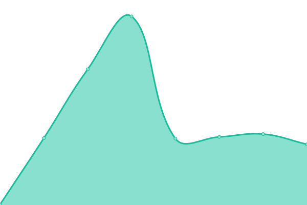

# [📈 Live Status](https://status.ludoviko.ch): <!--live status--> **🟧 Partial outage**

This repository contains the open-source uptime monitor and status page for [Ludoviko](https://ludoviko.ch), powered by [Upptime](https://github.com/upptime/upptime).

With [Upptime](https://upptime.js.org), you can get your own unlimited and free uptime monitor and status page, powered entirely by a GitHub repository. We use [Issues](https://github.com/Lucxjo/status.ludoviko.ch/issues) as incident reports, [Actions](https://github.com/Lucxjo/status.ludoviko.ch/actions) as uptime monitors, and [Pages](https://status.ludoviko.ch) for the status page.

<!--start: status pages-->
<!-- This summary is generated by Upptime (https://github.com/upptime/upptime) -->
<!-- Do not edit this manually, your changes will be overwritten -->
<!-- prettier-ignore -->
| URL | Status | History | Response Time | Uptime |
| --- | ------ | ------- | ------------- | ------ |
|  [Ludoviko Website](https://ludoviko.ch) | 🟩 Up | [ludoviko-website.yml](https://github.com/Lucxjo/status.ludoviko.ch/commits/HEAD/history/ludoviko-website.yml) | 

 600ms
     
 | 

<a href="https://status.ludoviko.ch/history/ludoviko-website">100.00%</a>
    

|  [Diru (Discord bot)](https://diru.ludoviko.ch) | 🟥 Down | [diru-discord-bot.yml](https://github.com/Lucxjo/status.ludoviko.ch/commits/HEAD/history/diru-discord-bot.yml) | 

 564ms
     
 | 

<a href="https://status.ludoviko.ch/history/diru-discord-bot">0.00%</a>
    

|  [VannerBasta Website](https://vannerba.st) | 🟩 Up | [vanner-basta-website.yml](https://github.com/Lucxjo/status.ludoviko.ch/commits/HEAD/history/vanner-basta-website.yml) | 

 325ms
     
 | 

<a href="https://status.ludoviko.ch/history/vanner-basta-website">100.00%</a>
    

|  [openPronouns Website](https://opronouns.net) | 🟩 Up | [open-pronouns-website.yml](https://github.com/Lucxjo/status.ludoviko.ch/commits/HEAD/history/open-pronouns-website.yml) | 

 110ms
     
 | 

<a href="https://status.ludoviko.ch/history/open-pronouns-website">100.00%</a>
    

<!--end: status pages-->

[**Visit our status website →**](https://status.ludoviko.ch)

## 📄 License

- Powered by: [Upptime](https://github.com/upptime/upptime)
- Code: [MIT](./LICENSE) © [Ludoviko](https://ludoviko.ch)
- Data in the `./history` directory: [Open Database License](https://opendatacommons.org/licenses/odbl/1-0/)
